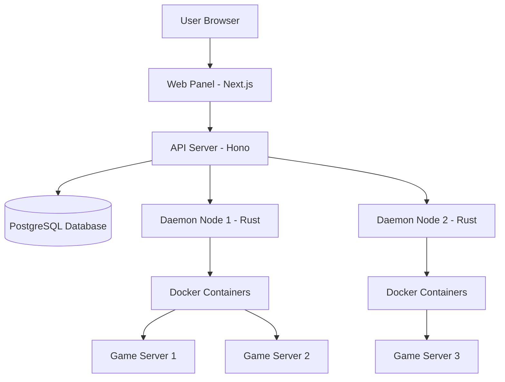

StellarStack uses a modern, distributed architecture designed for scalability, performance, and self-hosting. This guide explains how the system works and how different components interact.

## Architecture Overview

StellarStack uses a **daemon-per-node architecture** with four main components:

1. **API Server** (Hono + PostgreSQL) - Central control plane for authentication, permissions, and orchestration
2. **Web Panel** (Next.js 15) - Real-time dashboard with WebSocket updates
3. **Daemon Nodes** (Rust) - One per physical server, manages Docker containers running game servers
4. **Database** (PostgreSQL + Prisma) - Single source of truth with row-level security

## Key Concepts

### Servers

Individual game server instances running in Docker containers. Each server is isolated and has its own resources, ports, and file system.

### Nodes

Physical or virtual machines running the Rust daemon. Each node can host multiple game servers and communicates with the API server for orchestration.

### Locations

Logical grouping of nodes (e.g., "US-East", "EU-West"). Locations help organize infrastructure and allow users to choose where their servers run.

### Blueprints

Pre-configured templates for common game servers. Blueprints define:
- Docker image to use
- Default environment variables
- Port mappings
- Resource limits
- Startup commands

### Subusers

Users invited to access specific servers with custom permissions. The system supports 45+ permission nodes for granular access control (console access, file manager, backups, etc.).

## Technology Stack

### Backend (API)

<CardGroup cols={2}>
  <Card title="Hono" icon="bolt">
    Lightweight web framework capable of ~40k requests/second. Used for API endpoints and routing.
  </Card>
  
  <Card title="Better Auth" icon="shield">
    Modern authentication with OAuth, 2FA, and passkey support. Handles session management and security.
  </Card>
  
  <Card title="Prisma" icon="database">
    Type-safe ORM with PostgreSQL. Provides schema management, migrations, and query building.
  </Card>
  
  <Card title="WebSocket" icon="plug">
    Real-time console output and server statistics. Enables live updates without polling.
  </Card>
</CardGroup>

### Frontend (Web Panel)

<CardGroup cols={2}>
  <Card title="Next.js 15" icon="react">
    React framework with App Router and Server Components for optimal performance.
  </Card>
  
  <Card title="React 19" icon="atom">
    UI library with Server Components for improved initial load times.
  </Card>
  
  <Card title="Tailwind CSS" icon="palette">
    Utility-first CSS framework for rapid UI development.
  </Card>
  
  <Card title="TanStack Query" icon="arrows-rotate">
    Data fetching and caching library for efficient server state management.
  </Card>
</CardGroup>

### Daemon (Nodes)

<CardGroup cols={2}>
  <Card title="Rust" icon="gear">
    Systems programming language for performance and safety. Ensures low-overhead server management.
  </Card>
  
  <Card title="Docker" icon="docker">
    Container runtime for server isolation. Each game server runs in its own container.
  </Card>
  
  <Card title="Tokio" icon="bolt">
    Async runtime for concurrent operations. Handles multiple servers efficiently.
  </Card>
</CardGroup>

### Infrastructure

<CardGroup cols={2}>
  <Card title="pnpm" icon="box">
    Fast, disk-efficient package manager with workspace support.
  </Card>
  
  <Card title="Turborepo" icon="gauge-high">
    Monorepo build system with intelligent caching for fast builds.
  </Card>
  
  <Card title="PostgreSQL" icon="database">
    Production-grade relational database for data persistence.
  </Card>
  
  <Card title="Docker Compose" icon="layer-group">
    Local development environment orchestration.
  </Card>
</CardGroup>

## Design Decisions

### Why Daemon-Per-Node?

The daemon-per-node architecture provides several benefits:

- **Isolation**: Game servers are isolated in Docker containers, preventing interference
- **Scalability**: Add nodes without modifying existing infrastructure
- **Security**: Daemon runs with minimal permissions, reducing attack surface
- **Performance**: Rust daemon provides low-overhead container management
- **Flexibility**: Each node can have different hardware configurations

### Why Docker for Game Servers?

Docker containers provide:

- **Resource Limits**: CPU and memory limits prevent one server from consuming all resources
- **Port Management**: Automatic port allocation and mapping
- **File System Isolation**: Each server has its own file system
- **Easy Cleanup**: Removing a server is as simple as deleting a container
- **Consistent Environment**: Same environment across development and production

### Why PostgreSQL?

PostgreSQL was chosen for:

- **ACID Compliance**: Ensures data integrity for critical operations
- **Row-Level Security**: Fine-grained access control at the database level
- **JSON Support**: Flexible schema for configuration and metadata
- **Performance**: Excellent performance for read-heavy workloads
- **Ecosystem**: Rich tooling and extension ecosystem

### Why Monorepo?

The monorepo structure provides:

- **Code Sharing**: Shared UI components and TypeScript configs
- **Atomic Changes**: Update API and web panel in a single commit
- **Consistent Tooling**: Same linting, formatting, and build tools everywhere
- **Simplified Dependencies**: No need to publish internal packages
- **Better DX**: Single `pnpm dev` starts all services

## Data Flow

### Server Creation Flow

<Steps>
  <Step title="User submits request">
    User submits server creation request through web panel
  </Step>
  
  <Step title="API validates request">
    API validates permissions, checks node capacity, and creates database record
  </Step>
  
  <Step title="API sends command to daemon">
    API sends container creation command to selected daemon node
  </Step>
  
  <Step title="Daemon creates container">
    Daemon pulls Docker image, creates container with configured resources
  </Step>
  
  <Step title="Daemon reports status">
    Daemon reports creation status back to API
  </Step>
  
  <Step title="Web panel updates">
    Web panel receives WebSocket update and shows new server
  </Step>
</Steps>

### Real-Time Console Flow

<Steps>
  <Step title="User opens console">
    User navigates to server console in web panel
  </Step>
  
  <Step title="WebSocket connection established">
    Web panel establishes WebSocket connection to API server
  </Step>
  
  <Step title="API connects to daemon">
    API forwards WebSocket connection to appropriate daemon node
  </Step>
  
  <Step title="Daemon attaches to container">
    Daemon attaches to Docker container's stdout/stderr streams
  </Step>
  
  <Step title="Console output streamed">
    Console output is streamed in real-time: Container → Daemon → API → Web Panel
  </Step>
</Steps>

## Security Architecture

### Authentication & Authorization

- **Better Auth**: Handles user authentication with session tokens
- **bcrypt**: Password hashing with cost factor 10
- **Permission Nodes**: 45+ granular permissions for fine-grained access control
- **Row-Level Security**: Database-level access control for multi-tenancy

### Data Protection

- **AES-256-CBC**: Encryption for sensitive data at rest
- **HTTPS**: All communication encrypted in transit
- **Rate Limiting**: Protection against brute-force attacks
- **CSRF Tokens**: All state-changing requests protected
- **Security Headers**: CSP, X-Frame-Options, HSTS

### Container Isolation

- **Network Isolation**: Containers run in isolated networks
- **File System Isolation**: Each container has its own file system
- **Resource Limits**: CPU and memory limits prevent resource exhaustion
- **User Namespaces**: Containers run with unprivileged users

## Performance Considerations

### Caching Strategy

- **TanStack Query**: Client-side caching of API responses
- **Turborepo**: Build output caching for fast rebuilds
- **React Server Components**: Reduced client-side JavaScript
- **Database Indexes**: Optimized queries for common operations

### Optimization Techniques

- **WebSocket**: Real-time updates without polling overhead
- **Lazy Loading**: Code splitting for faster initial page loads
- **Parallel Operations**: Concurrent processing where possible
- **Database Connection Pooling**: Reuse connections for better performance

## Scalability

### Horizontal Scaling

- **API Servers**: Multiple API instances behind load balancer
- **Daemon Nodes**: Add nodes to increase server capacity
- **Database**: PostgreSQL replication for read scaling
- **Static Assets**: CDN for frontend assets

### Vertical Scaling

- **Database**: Increase PostgreSQL resources for larger workloads
- **API Server**: Increase CPU/memory for higher request throughput
- **Daemon Nodes**: Larger nodes can host more game servers

## Future Improvements

- **Kubernetes Support**: Deploy game servers on Kubernetes clusters
- **Multi-Region Clustering**: Distribute nodes across regions
- **Advanced Analytics**: Real-time metrics and dashboards
- **Plugin System**: Custom game support through plugins
- **CLI Tool**: Command-line interface for server management