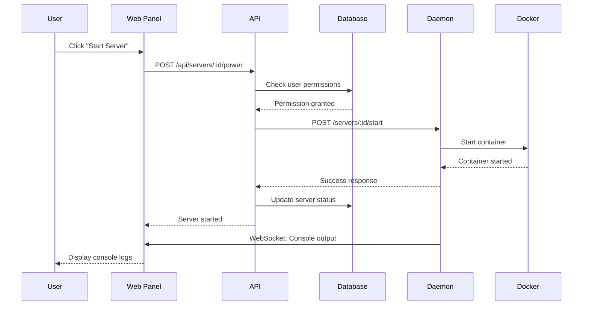

# How it works

StellarStack uses a **daemon-per-node architecture** inspired by modern container orchestration platforms. This design separates concerns between the control plane (API + Web Panel) and the data plane (Daemon Nodes).

## Architecture overview

<Steps>
  <Step title="API Server (Hono + PostgreSQL)">
    The central control plane handles authentication, permissions, and orchestration. Built with Hono for high-performance HTTP handling (~40k req/s) and PostgreSQL for reliable data persistence.
    
    **Responsibilities:**
    - User authentication and session management
    - Permission checks and authorization
    - Server configuration and metadata
    - Backup scheduling and retention policies
    - Webhook management and event dispatching
  </Step>
  
  <Step title="Web Panel (Next.js 15)">
    Real-time dashboard built with React 19 and Next.js App Router. Connects to both the API (REST) and nodes (WebSocket) for live updates.
    
    **Features:**
    - Server-side rendering for fast page loads
    - WebSocket connections for real-time console output
    - TanStack Query for efficient data fetching and caching
    - Responsive design with Tailwind CSS and shadcn/ui
  </Step>
  
  <Step title="Daemon Nodes (Rust)">
    One daemon per physical server manages Docker containers running game servers. Written in Rust for performance, safety, and low resource overhead.
    
    **Responsibilities:**
    - Docker container lifecycle (create, start, stop, delete)
    - Port allocation and network management
    - File system operations and SFTP server
    - Resource monitoring (CPU, memory, disk, network)
    - Log streaming via WebSocket
  </Step>
  
  <Step title="Database (PostgreSQL + Prisma)">
    Single source of truth for all state. Prisma ORM provides type-safe database access with automatic migrations.
    
    **Key tables:**
    - Users, sessions, and authentication
    - Servers, nodes, and locations
    - Backups, tasks, and webhooks
    - Permissions and server memberships
  </Step>
</Steps>

## Request flow

Here's what happens when you start a game server:



## Daemon communication

The API communicates with daemons via HTTP REST endpoints. Each daemon exposes:

<CodeGroup>
```typescript API Client (Hono)
// From apps/api/src/routes/servers.ts
import { Hono } from "hono";
import type { Context } from "hono";

const servers = new Hono<{ Variables: Variables }>();

// Forward power action to daemon
servers.post("/:id/power", requireAuth, async (c) => {
  const serverId = c.req.param("id");
  const { action } = await c.req.json();
  
  // Get server and node info from database
  const server = await db.server.findUnique({
    where: { id: serverId },
    include: { node: true }
  });
  
  // Forward to daemon
  const response = await fetch(`${server.node.address}/servers/${serverId}/power`, {
    method: "POST",
    headers: { "Content-Type": "application/json" },
    body: JSON.stringify({ action })
  });
  
  return c.json(await response.json());
});
```

```rust Daemon Handler (Axum)
// From apps/daemon/src/handlers/power.rs (conceptual)
use axum::{Json, extract::Path};
use bollard::Docker;

#[derive(Deserialize)]
struct PowerAction {
    action: String, // "start", "stop", "restart", "kill"
}

async fn handle_power(
    Path(server_id): Path<String>,
    Json(payload): Json<PowerAction>,
) -> Result<Json<Response>, Error> {
    let docker = Docker::connect_with_socket_defaults()?;
    
    match payload.action.as_str() {
        "start" => docker.start_container(&server_id, None).await?,
        "stop" => docker.stop_container(&server_id, None).await?,
        "restart" => docker.restart_container(&server_id, None).await?,
        "kill" => docker.kill_container(&server_id, None).await?,
        _ => return Err(Error::InvalidAction),
    }
    
    Ok(Json(Response { success: true }))
}
```
</CodeGroup>

## Docker container isolation

Each game server runs in its own Docker container with:

<CardGroup cols={2}>
  <Card title="Resource limits" icon="gauge">
    CPU cores, memory (RAM), and disk space limits enforced by Docker cgroups
  </Card>
  <Card title="Network isolation" icon="network-wired">
    Dedicated ports mapped from container to host (e.g., 25565 → 25565)
  </Card>
  <Card title="File system isolation" icon="folder">
    Bind mounts for server files, preventing access to host system
  </Card>
  <Card title="Process isolation" icon="shield">
    Game servers can't see or affect other containers or the host OS
  </Card>
</CardGroup>

Example Docker container configuration:

```json
{
  "Image": "stellarstack/minecraft:latest",
  "Hostname": "minecraft-server-abc123",
  "ExposedPorts": {
    "25565/tcp": {},
    "25565/udp": {}
  },
  "HostConfig": {
    "Binds": [
      "/var/lib/stellarstack/servers/abc123:/server"
    ],
    "PortBindings": {
      "25565/tcp": [{ "HostPort": "25565" }],
      "25565/udp": [{ "HostPort": "25565" }]
    },
    "Memory": 4294967296,
    "CpuQuota": 200000,
    "RestartPolicy": {
      "Name": "unless-stopped"
    }
  },
  "Env": [
    "EULA=true",
    "SERVER_PORT=25565",
    "MAX_PLAYERS=20"
  ]
}
```

## Real-time updates with WebSocket

Console output and statistics stream via WebSocket connections:

<Tabs>
  <Tab title="Frontend (React Hook)">
    ```typescript
    // From apps/web/hooks/useConsole.ts (conceptual)
    import { useEffect, useState } from 'react';
    
    export function useConsole(serverId: string) {
      const [logs, setLogs] = useState<string[]>([]);
      const [ws, setWs] = useState<WebSocket | null>(null);
      
      useEffect(() => {
        const socket = new WebSocket(`ws://localhost:3001/api/ws/console/${serverId}`);
        
        socket.onmessage = (event) => {
          const data = JSON.parse(event.data);
          if (data.type === 'console') {
            setLogs((prev) => [...prev, data.message]);
          }
        };
        
        setWs(socket);
        return () => socket.close();
      }, [serverId]);
      
      const sendCommand = (command: string) => {
        ws?.send(JSON.stringify({ type: 'command', data: command }));
      };
      
      return { logs, sendCommand };
    }
    ```
  </Tab>
  
  <Tab title="Backend (WebSocket Manager)">
    ```typescript
    // From apps/api/src/lib/ws.ts (simplified)
    import type { WSContext } from 'hono/ws';
    
    class WebSocketManager {
      private connections = new Map<string, Set<WSContext>>();
      
      // Subscribe client to server events
      subscribe(serverId: string, ws: WSContext) {
        if (!this.connections.has(serverId)) {
          this.connections.set(serverId, new Set());
        }
        this.connections.get(serverId)!.add(ws);
      }
      
      // Broadcast console output to all subscribers
      emitServerEvent(serverId: string, event: string, data: any) {
        const clients = this.connections.get(serverId);
        if (!clients) return;
        
        const message = JSON.stringify({ type: event, data });
        for (const client of clients) {
          client.send(message);
        }
      }
    }
    
    export const wsManager = new WebSocketManager();
    ```
  </Tab>
  
  <Tab title="Daemon (Log Streaming)">
    ```rust
    // From apps/daemon/src/websocket.rs (conceptual)
    use bollard::container::LogsOptions;
    use futures::StreamExt;
    
    async fn stream_logs(server_id: &str, ws: WebSocket) {
        let docker = Docker::connect_with_socket_defaults().unwrap();
        
        let options = LogsOptions::<String> {
            follow: true,
            stdout: true,
            stderr: true,
            ..Default::default()
        };
        
        let mut log_stream = docker.logs(server_id, Some(options));
        
        while let Some(Ok(output)) = log_stream.next().await {
            let message = serde_json::json!({
                "type": "console",
                "message": output.to_string()
            });
            
            ws.send(Message::Text(message.to_string())).await;
        }
    }
    ```
  </Tab>
</Tabs>

## Authentication and authorization

StellarStack uses a multi-layered security approach:

<Steps>
  <Step title="Better Auth for sessions">
    Session management with secure HTTP-only cookies. Supports email/password, OAuth (Google, GitHub, Discord), 2FA, and passkeys.
    
    ```typescript
    // From apps/api/src/lib/auth.ts
    import { betterAuth } from "better-auth";
    import { prismaAdapter } from "better-auth/adapters/prisma";
    import { passkey } from "@better-auth/passkey";
    
    export const auth = betterAuth({
      database: prismaAdapter(db, { provider: "postgresql" }),
      emailAndPassword: { enabled: true },
      socialProviders: {
        google: { clientId: process.env.GOOGLE_CLIENT_ID!, clientSecret: process.env.GOOGLE_CLIENT_SECRET! },
        github: { clientId: process.env.GITHUB_CLIENT_ID!, clientSecret: process.env.GITHUB_CLIENT_SECRET! },
        discord: { clientId: process.env.DISCORD_CLIENT_ID!, clientSecret: process.env.DISCORD_CLIENT_SECRET! },
      },
      plugins: [passkey()],
    });
    ```
  </Step>
  
  <Step title="Middleware for route protection">
    API middleware checks authentication and authorization before processing requests.
    
    ```typescript
    // From apps/api/src/middleware/auth.ts
    export const requireAuth = async (c: Context, next: Next) => {
      const session = await auth.api.getSession({ headers: c.req.raw.headers });
      if (!session) return c.json({ error: "Unauthorized" }, 401);
      c.set("user", session.user);
      await next();
    };
    
    export const requireServerAccess = async (c: Context, next: Next) => {
      const serverId = c.req.param("id");
      const user = c.get("user");
      
      // Check if user owns server or is a member with permissions
      const access = await db.server.findFirst({
        where: {
          id: serverId,
          OR: [
            { ownerId: user.id },
            { members: { some: { userId: user.id } } }
          ]
        }
      });
      
      if (!access) return c.json({ error: "Forbidden" }, 403);
      await next();
    };
    ```
  </Step>
  
  <Step title="Granular permissions (45+ nodes)">
    Fine-grained permission system for subusers. Permissions like `server.console.read`, `server.files.write`, `server.backup.create`.
    
    ```typescript
    // From apps/api/prisma/schema.prisma
    model ServerMember {
      id          String   @id @default(cuid())
      serverId    String
      userId      String
      permissions Json     // Array of permission strings
      createdAt   DateTime @default(now())
      
      server Server @relation(fields: [serverId], references: [id])
      user   User   @relation(fields: [userId], references: [id])
      
      @@unique([serverId, userId])
      @@map("server_members")
    }
    ```
  </Step>
</Steps>

## Scalability considerations

<Note>
  While StellarStack is currently in alpha, the architecture is designed for horizontal scaling:
  
  - **API servers**: Stateless and load-balanced behind nginx or a cloud load balancer
  - **Daemon nodes**: Add more physical servers, register them via the admin panel
  - **Database**: PostgreSQL supports read replicas and connection pooling
  - **WebSocket**: Can be scaled with Redis pub/sub for cross-server communication
</Note>

## Next steps

<CardGroup cols={2}>
  <Card title="Tech Stack" icon="layer-group" href="/tech-stack">
    Dive deep into the technologies powering each component
  </Card>
  <Card title="Installation" icon="download" href="/getting-started/installation">
    Get StellarStack running on your infrastructure
  </Card>
</CardGroup>
